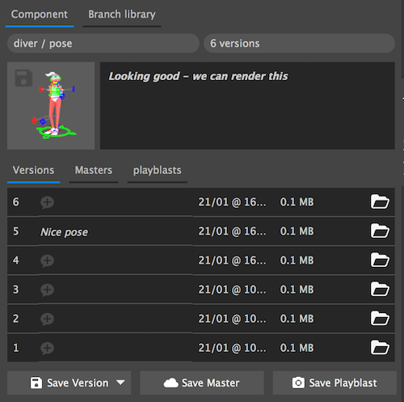
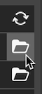
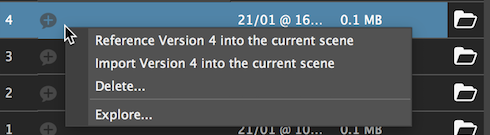
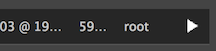
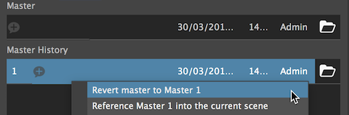

#The component tab

When you select a component from the navigation panel, its will show in the component panel.

The panel is made of the component path, number of versions, thumbnail and a note.

* **Save a thumbnail** - click on the small disc icon at the top left corner of the thumbnail.
* **Save or edit note** - double click the note area.

***

###Versions 

The version tab will display all the versions of the component.

* **Open version** - click the open button to load requested version. 

    
    
    * _If the version is already loaded a reload button will appear._

* **Save note** - double click the + balloon. 

_Additionally we can see the file size, save time & data and the user that saved the version (For project's with users)._ 

####Save version

* **Save version** - Save the current maya file as a new version.
* **Save only selection** - Save the current selection as a new version.
    * You can choose to save with with all connection or just textures.
* **Save from file** - Select a file to save as the new version.

####Version actions menu

Right click on a version to invoke the menu

* **Reference version # into the current scene** - Reference the selected version onto the current open scene.
* **Import version # into the current scene** - Import the selected version onto the current open scene.
* **Delete** - Delete's the selected version
* **Explore** - Open the finder / explorer window on the current selected item.
***

###Masters & Playblasts

* **Master** - Unversioned file with the 'MASTER' suffix.
* **Master versions**

!!! Note
    In playblasts tab, the open button is replaced with a play button to launch the video in the defult video player.
    
    
    
If we want to revert our master file to an older version, we can use the **revert** action. 

