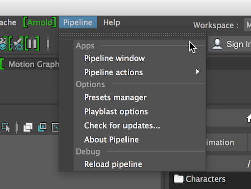
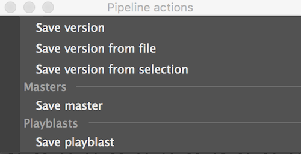

#Pipeline menu

Some of Pipeline features are accessed only through the pipeline menu.

##Apps

**Pipeline window** - brings up the pipeline window

**Pipeline actions** - Pipeline saving options

!!! tip
    Tear off this menu to have quick access to the saving buttons when the pipeline window is hidden.

##Options

**Preset manager** - brings up the [preset manager](../presets)

**Playblast options** - brings up the Playblast options

!!! bug
    Playblasting from Pipeline on windows machines is unstable, especially if no H264 codecs are installed.
    This will be fixed soon.

##Debug

**Reload Pipeline** - Pipeline is constantly being developed and might contain bugs. 
if you experience issues when running pipeline try using the reload command.

!!! note
    Please consider reporting bugs to liorbenhorin@gmail.com. 
    Try to describe the steps to recreate the problem, and include the output from the script editor. 
    Any additional information can help: Operation system, Maya version, etc. 
    Thank you!
    
