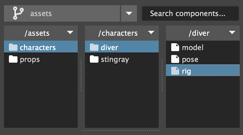

#The navigation panel

The navigation panel is where we can view and edit our project structure.

##Branch switcher

Lists all the projects branches.
Setting a branch will display it's content in the folder viewer and the components library.

!!! note
    * Adding and removing branches is done from the project edit window.
    * Users without administration privileges can not edit projects.

 
***

##Folders and actions

To invoke the folder aciton's menu click the folder title or right click.

#### Create component

* **Name** - The component name (Usually will stand for the task name. eg. Model)
* **Initial version** - You can create you new component with a clean file for the first version, 
From the current scene, from a current selection, from a file, or not create the first version at all.
* **File name format** - How to compose the maya file name. 
The amount of parent categories to include in the name. 
See the live preview updating when you change the numbers.

#### Create category

* **Name** - The category name
* **Range** - from - to (instead of inputting the number of folders, we define the range)
* **padding** - how to format the numbers (padding of 3 = 001)

!!! tip
    To create a single folder with no numbering, set from and to at 1, and padding to 0 

####Explore

Open the finder / explorer window on the current selected item.

####Delete

Delete the item and all it's children

####Rename

Rename the item and all it's children items. (And maya files)

!!! warning
    Never use this feature when the item or children of the item are being referenced into other files. 

***

##Search in branch

Enter your search string to filter components in the current branch

!!! bug
    May be slow or hang Maya on branches with many components   