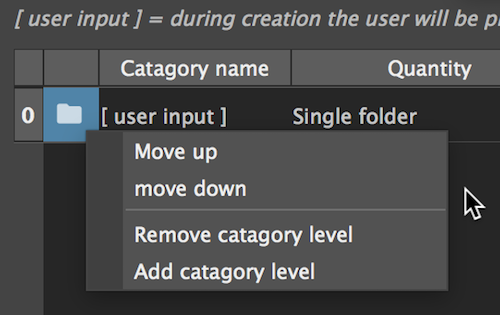

#Presets

Presets are used to design a folder structure schema that describes the studio's tasks 
and enable the user to generate common tree structures quickly.

A preset will ask for user input to generate a folder tree with all the needed components and categories with just a few clicks.

Presets can be created from the ui, exported and imported as json files and shared between friends and colleagues.

*In this example, a preset is used to generate all the components needed for the "Animal" character,  
Notice how the categories are duplicated in both "assets" and "sourceimages" branches. 
In maya, this structure can be very helpful*

***

## The preset manager

In the preset manager we can create and edit our presets. 
The preset is made up of categories and components

###Categories

In this table we will define our categories (folders) hierarchy. 
Each row will be created with its 'child' row inside of her.

**Right click to add, remove and move up/down categories**

**For each catagory, we will set:**

1. name
2. quantaty selector (single / multiple)
3. from - to (insted of inputing the number of folders, we define the range)
5. padding - how to format the numbers (padding of 3 = 001)

!!! tip
    To create a single folder with no numbering, set from and to at 1 and padding to 0 

!!! note
    To let the user input a value during generation- select "[user input]" 
    

###Components

In this table we will define our components...
Each component will be created at the bottom of the categories hierarchy. 

***The categories hierarchy will be created under the defined branch.***

* Non existing branches will be generated.
* Contant will be added to existing branches.

**Right click to add and remove components**

1. name
2. branch
3. format - Used to define how actual maya file names will be formatted

####Component name format

The file names will be compiled from each heirarchy level, followed by the component name, and versions number. 
`<LEVEL001>_<LEVEL002>_<COMPONENT>_v001.ma`

The formatter use the format value to select how many hierarchy level to use when forming the name.

To avoid a name like this (The 'Characters' is pretty obvious here): 
`Characters_animal_rig_v001.ma` 
Use a format value of 2, which will result in this name: 
`animal_rig_v001.ma` 

***

##Preset generation

From the project navigator, on any branch, in the root dir action menu: 

!!! note
    Any preset saved to the pipeline presets dir will be listed in this menu. 
    To load a preset from other location, click "From file..."
