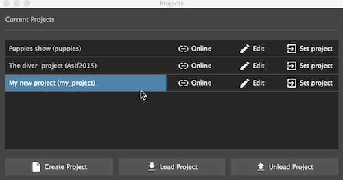
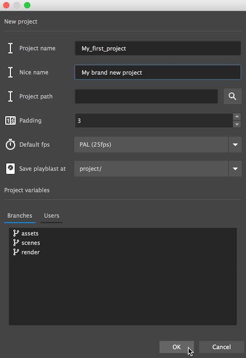

#The projects manager

This is where we manage our projects. 
We can create projects, load and unload existing projects for quick opening.

##Create project

In the creation diaglog we will initilize our new project with it's variables.

* **Project name** - the projects folder name, must be leagal charchters, no spaces.
* **Nice name** - a friendly display name for the project.
    
    !!! tip
        This can help when the project's name has to be 'MAYA' to fit some studio's workflow

* **Path** - where to save the project.
* **Padding** - The padding value pipeline will use when foramatting version numbers. 
eg. v001 equals a padding value of 3
* **Default FPS** - New scenes will automatically get configured with this frame rate
* **Save playblasts at** - We can save playblasts at one of three locations:
    1. _/project_ - Playblasts will be saved on the projects root under playbalasts folder
    2. _../project_ - Playblasts will be saved on a sister directory to the projects root folder, in a folder called playblasts
    3. _/component_ - Playbasts will be saved under each component that is recording them

    !!! tip
        * This setting can be modified at all times, and pipeline will handle the files relocation.
        * The movies will be stored in a folder structure mirrored to their components 

* **Branches** - represent production sections, eg. Assets, animation, render, or any other high level phase of your project. 
You can add / remove them later as well.
* **Users** - Assign users to a project when you want to let team members collaborate - but with limited functionality, eg. Simple users can not delete files, and can not save master versions. 
Users also help you track who is saving versions.

    !!! note
        Projects with users require logging in with password when setting project.
    