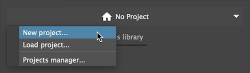
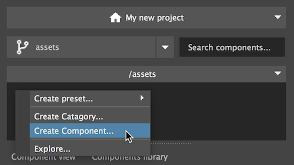
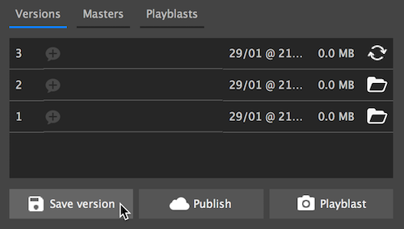

**Let's create our first project and save our first versioned item**

From the projects switcher, select new project… and fill in the required fields.

To start creating files right click inside the folder browser below the branch selector and pick any of the presets.

    
To start saving versions navigate to any component and use save version.
The current scene will be saved as the first version of your component.

!!! tip
    Click the chat balloon icons to save a version specific massage
    

